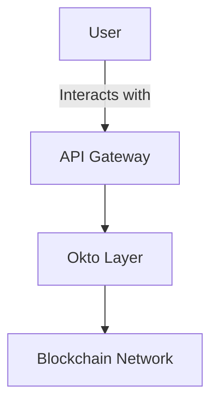

# Okto Layer Documentation

Welcome to the **Okto Layer Documentation Project**, a comprehensive and interactive documentation site built using **Fumadocs**, a modern documentation framework. This project is designed to provide developers with everything they need to integrate and utilize Okto Layer’s innovative decentralized solutions.

---

## 🚀 Features

- **Interactive API Playground**: Test APIs directly from the documentation with real-time results.
- **Dynamic Flowcharts and Diagrams**: Visualize complex systems using Mermaid.js diagrams.
- **Accordion-based FAQ**: Easily accessible answers to common questions.
- **Code Snippets**: Pre-written examples in multiple programming languages.
- **Table of Contents (ToC)**: Auto-generated ToC for seamless navigation.
- **Responsive Design**: Fully optimized for mobile and desktop usage.

---

## 📂 Project Structure

```plaintext
├── content/
│   ├── docs/
│   │   ├── core/
│   │   │   ├── oktochain.mdx          # Documentation for OktoChain
│   │   │   ├── dtn.mdx               # Documentation for Decentralized Transaction Network
│   │   │   ├── dwn.mdx               # Documentation for Decentralized Wallet Network
│   │   │   ├── ull.mdx               # Documentation for Unified Liquidity Layer
│   │   │   └── playground.mdx        # Interactive playground page
│   └── overview.mdx                  # High-level overview of Okto Layer
├── components/
│   ├── ApiExplorer.tsx               # Interactive API Explorer component
│   ├── TransactionSimulator.tsx      # Multi-chain transaction simulator
│   └── AccordionFAQ.tsx              # Accordion-based FAQ component
├── public/
│   └── assets/                       # Images and static assets for the docs
├── styles/
│   └── global.css                    # Custom CSS for styling
├── package.json                      # Project dependencies
└── README.md                         # Project readme
```


---
title: Flowchart
description: Documentation for the new feature in Okto Layer.
---

# New Feature

Learn about the new feature in the Okto Layer. Here's an example flowchart:



# 🧩 Custom Components
Interactive API Playground
The API Playground allows users to test APIs directly within the documentation.

Usage:
```javascript
import ApiExplorer from "../components/ApiExplorer";

<ApiExplorer
   endpoints={[
      { method: "GET", path: "/wallets", description: "Fetch all wallets" },
      { method: "POST", path: "/transactions", description: "Create a transaction" },
   ]}
/>;
```

# 📊 Dynamic Diagrams
Mermaid.js
Mermaid.js is used to create flowcharts and diagrams in the documentation.

Example:
```plaintext
graph TD;
subgraph AA [Consumers]
A[Mobile App];
B[Web App];
C[Node.js Client];
end
subgraph BB [Services]
E[REST API];
F[GraphQL API];
end
Z[Gateway];
A --> Z;
B --> Z;
C --> Z;
Z --> E;
Z --> F;
```

```plaintext
```mermaid
[Your Mermaid.js code here]
```

# 🛡️ Deployment
Deploy your project to any platform supporting Next.js, such as Vercel or Netlify.

Deploy on Vercel
Install the Vercel CLI:

```bash
npm install -g vercel
```

```bash
vercel
```

# 📃 License
This project is licensed under the MIT License.
```plaintext

This markdown continuation is tailored for ease of use in a **Fumadocs** project and includes instructions for working with content, reusable components, diagrams, and deployment steps.

```
