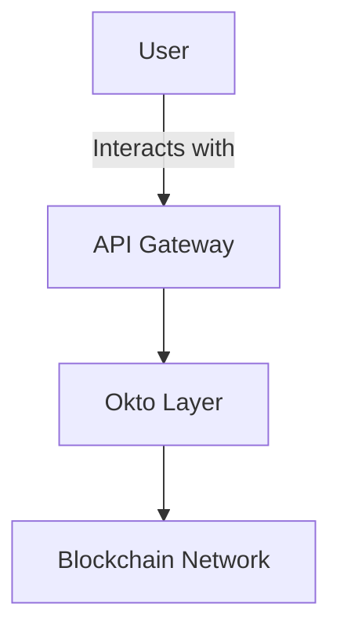

# Okto Layer Documentation

Welcome to the **Okto Layer Documentation Project**, a comprehensive and interactive documentation site built using **Fumadocs**, a modern documentation framework. This project is designed to provide developers with everything they need to integrate and utilize Okto Layer’s innovative decentralized solutions.

---

## 🚀 Features

- **Interactive API Playground**: Test APIs directly from the documentation with real-time results.
- **Dynamic Flowcharts and Diagrams**: Visualize complex systems using Mermaid.js diagrams.
- **Accordion-based FAQ**: Easily accessible answers to common questions.
- **Code Snippets**: Pre-written examples in multiple programming languages.
- **Table of Contents (ToC)**: Auto-generated ToC for seamless navigation.
- **Responsive Design**: Fully optimized for mobile and desktop usage.

---

## 📂 Project Structure

```plaintext
├── content/
│   ├── docs/
│   │   ├── core/
│   │   │   ├── oktochain.mdx          # Documentation for OktoChain
│   │   │   ├── dtn.mdx               # Documentation for Decentralized Transaction Network
│   │   │   ├── dwn.mdx               # Documentation for Decentralized Wallet Network
│   │   │   ├── ull.mdx               # Documentation for Unified Liquidity Layer
│   │   │   └── playground.mdx        # Interactive playground page
│   └── overview.mdx                  # High-level overview of Okto Layer
├── components/
│   ├── ApiExplorer.tsx               # Interactive API Explorer component
│   ├── TransactionSimulator.tsx      # Multi-chain transaction simulator
│   └── AccordionFAQ.tsx              # Accordion-based FAQ component
├── public/
│   └── assets/                       # Images and static assets for the docs
├── styles/
│   └── global.css                    # Custom CSS for styling
├── package.json                      # Project dependencies
└── README.md                         # Project readme
```

# Documentation Sidebar Structure

This document explains the sidebar structure for the Fumadocs-based documentation project, including the **core components**, **SDKs**, and additional sections for guides and resources.

---

## 📚 Sidebar Navigation Overview

The sidebar provides a clear, hierarchical structure for navigating through the documentation. Below is the detailed structure for the sidebar, including all links to pages and sections.

### **Core Components**

The core components section focuses on explaining the primary building blocks of the Okto Layer.

- **DTN (Decentralized Transaction Network)**  
  Path: `/docs/core/dtn`  
  Description: Learn how the DTN automates complex multi-chain transactions with seamless orchestration.

- **DWN (Decentralized Wallet Network)**  
  Path: `/docs/core/dwn`  
  Description: Understand the unified, secure wallet system that spans multiple blockchains.

- **OktoChain**  
  Path: `/docs/core/oktochain`  
  Description: Explore the trustless coordination layer that ensures transparency and decentralization.

- **ULL (Unified Liquidity Layer)**  
  Path: `/docs/core/ull`  
  Description: Dive into the efficient cross-chain swapping and bridging powered by ERC-7683.

---

### **SDKs**

This section provides developer-friendly documentation for SDKs in different programming languages.

- **SDK Overview**  
  Path: `/docs/sdks/overview`  
  Description: High-level overview of all SDKs available for interacting with the Okto Layer.

- **React SDK**  
  Path: `/docs/sdks/javascript`  
  Description: Detailed guide for using the JavaScript SDK to interact with Okto Layer APIs and features.

- **Flutter SDK**  
  Path: `/docs/sdks/flutter`  
  Description: A comprehensive guide to integrating Okto Layer functionality into Python applications.
 
 ## Upcoming...
- **Go SDK**  
  Path: `/docs/sdks/go`  
  Description: Step-by-step documentation for developers using the Go SDK to interact with the Okto Layer.

- **Rust SDK**  
  Path: `/docs/sdks/rust`  
  Description: Documentation for building high-performance blockchain applications with the Rust SDK.

- **Java SDK**  
  Path: `/docs/sdks/java`  
  Description: Information for developers using the Java SDK to leverage the Okto Layer capabilities.

---

### **Guides**

This section includes practical guides to help developers and users get the most out of the Okto Layer.

- **Integration Guide**  
  Path: `/docs/guides/integration`  
  Description: A walkthrough for integrating the Okto Layer into your application.

- **API Usage**  
  Path: `/docs/guides/api-usage`  
  Description: Instructions for interacting with the Okto Layer APIs, including examples.

- **Developer FAQ**  
  Path: `/docs/guides/faq`  
  Description: Common questions and solutions for developers working with the Okto Layer.

---

### **Resources**

The resources section provides access to additional technical information, references, and updates.

- **API Reference**  
  Path: `/docs/resources/api-reference`  
  Description: Detailed API documentation for the Okto Layer endpoints.

- **Whitepaper**  
  Path: `/docs/resources/whitepaper`  
  Description: In-depth explanation of the Okto Layer architecture and design principles.

- **Changelog**  
  Path: `/docs/resources/changelog`  
  Description: A log of updates, improvements, and fixes for the Okto Layer.

---

## 🔧 How to Configure the Sidebar

The sidebar is defined in the project’s configuration file. Here’s an example YAML structure for the sidebar:

```yaml
- label: Core Components
  items:
    - label: DTN (Decentralized Transaction Network)
      link: /docs/core/dtn
    - label: DWN (Decentralized Wallet Network)
      link: /docs/core/dwn
    - label: OktoChain
      link: /docs/core/oktochain
    - label: ULL (Unified Liquidity Layer)
      link: /docs/core/ull

- label: SDKs
  items:
    - label: SDK Overview
      link: /docs/sdks/overview
    - label: JavaScript SDK
      link: /docs/sdks/javascript
    
- label: Guides
  items:
    - label: Integration Guide
      link: /docs/guides/integration
    - label: API Usage
      link: /docs/guides/api-usage
    - label: Developer FAQ
      link: /docs/guides/faq

- label: Resources
  items:
    - label: API Reference
      link: /docs/resources/api-reference
    - label: Whitepaper
      link: /docs/resources/whitepaper
    - label: Changelog
      link: /docs/resources/changelog
```

---
title: Flowchart
description: Documentation for the new feature in Okto Layer.
---

# New Feature

Learn about the new feature in the Okto Layer. Here's an example flowchart:



# 🧩 Custom Components
Interactive API Playground
The API Playground allows users to test APIs directly within the documentation.

Usage:
```javascript
import ApiExplorer from "../components/ApiExplorer";

<ApiExplorer
   endpoints={[
      { method: "GET", path: "/wallets", description: "Fetch all wallets" },
      { method: "POST", path: "/transactions", description: "Create a transaction" },
   ]}
/>;
```

# 📊 Dynamic Diagrams
Mermaid.js
Mermaid.js is used to create flowcharts and diagrams in the documentation.

Example:
```plaintext
graph TD;
subgraph AA [Consumers]
A[Mobile App];
B[Web App];
C[Node.js Client];
end
subgraph BB [Services]
E[REST API];
F[GraphQL API];
end
Z[Gateway];
A --> Z;
B --> Z;
C --> Z;
Z --> E;
Z --> F;
```

```plaintext
```mermaid
[Your Mermaid.js code here]
```

# 🛡️ Deployment
Deploy your project to any platform supporting Next.js, such as Vercel or Netlify.

Deploy on Vercel
Install the Vercel CLI:

```bash
npm install -g vercel
```

```bash
vercel
```

# 📃 License
This project is licensed under the MIT License.
```plaintext

This markdown continuation is tailored for ease of use in a **Fumadocs** project and includes instructions for working with content, reusable components, diagrams, and deployment steps.

```
