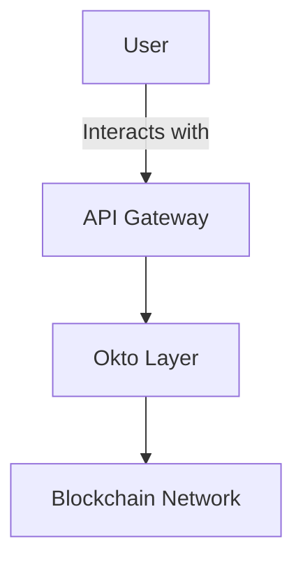

# Okto Layer Documentation

Welcome to the **Okto Layer Documentation Project**, a comprehensive and interactive documentation site built using **Fumadocs**, a modern documentation framework. This project is designed to provide developers with everything they need to integrate and utilize Okto Layer’s innovative decentralized solutions.

---

## 🚀 Features

- **Interactive API Playground**: Test APIs directly from the documentation with real-time results.
- **Dynamic Flowcharts and Diagrams**: Visualize complex systems using Mermaid.js diagrams.
- **Accordion-based FAQ**: Easily accessible answers to common questions.
- **Code Snippets**: Pre-written examples in multiple programming languages.
- **Table of Contents (ToC)**: Auto-generated ToC for seamless navigation.
- **Responsive Design**: Fully optimized for mobile and desktop usage.

---

## 📂 Project Structure

```plaintext
├── content/
│   ├── docs/
│   │   ├── core/
│   │   │   ├── oktochain.mdx          # Documentation for OktoChain
│   │   │   ├── dtn.mdx               # Documentation for Decentralized Transaction Network
│   │   │   ├── dwn.mdx               # Documentation for Decentralized Wallet Network
│   │   │   ├── ull.mdx               # Documentation for Unified Liquidity Layer
│   │   │   └── playground.mdx        # Interactive playground page
│   └── overview.mdx                  # High-level overview of Okto Layer
├── components/
│   ├── ApiExplorer.tsx               # Interactive API Explorer component
│   ├── TransactionSimulator.tsx      # Multi-chain transaction simulator
│   └── AccordionFAQ.tsx              # Accordion-based FAQ component
├── public/
│   └── assets/                       # Images and static assets for the docs
├── styles/
│   └── global.css                    # Custom CSS for styling
├── package.json                      # Project dependencies
└── README.md                         # Project readme


---
title: New Feature
description: Documentation for the new feature in Okto Layer.
---

# New Feature

Learn about the new feature in the Okto Layer. Here's an example flowchart:


