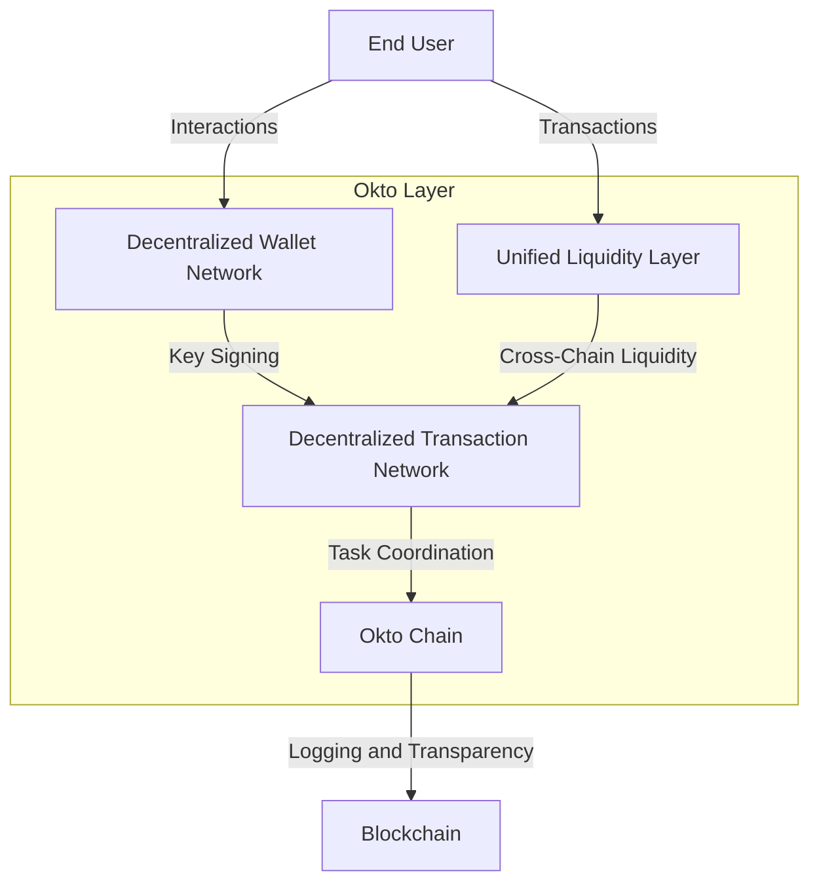

---
## Welcome
---

# 🌌 Introduction to Okto Layer

The **Okto Layer** is revolutionizing the way we interact with blockchain technology. By abstracting the complexities of Web3, it acts as your **universal bridge**, connecting diverse blockchains with the apps and services you love. Whether you're a seasoned developer or a newcomer to blockchain, Okto makes multi-chain interactions seamless and user-friendly.

---

## 🚀 Why Okto Layer?

Web3 has always been powerful, but it comes with challenges:

- **Fragmented Chains:** Navigating multiple networks with unique protocols can be overwhelming.
- **Complex Transactions:** Multi-step processes are time-consuming and error-prone.
- **Wallet Overload:** Juggling multiple wallets for different chains creates security risks and confusion.

Okto addresses these challenges with **innovative solutions** designed to simplify your Web3 experience.

---

## ✨ What Makes Okto Unique?

### 1. **Decentralized Wallet Networks (DWNs)**  
Your one wallet for every chain. Built with MPC security and trusted execution environments, DWNs ensure your keys stay safe while providing a unified wallet experience. No more seed phrases or hardware hassles.

### 2. **Unified Liquidity Layer (ULL)**  
Effortlessly swap tokens across chains. The ULL aggregates the best cross-chain solutions like LayerZero and Wormhole, optimizing for cost, speed, and security.

### 3. **Decentralized Transaction Networks (DTNs)**  
Automate complex, multi-chain transactions in a single step. From bridging to staking, DTNs handle the heavy lifting so you don’t have to.

### 4. **The Okto Chain**  
The trustless coordination layer ensuring transparency and decentralization for all operations.

---

## 🌍 A New Standard for Blockchain

With Okto, developers and users gain access to:

- **Chain Abstraction:** Forget about the differences between Ethereum, Solana, and others. Okto handles it.
- **Efficient Liquidity Access:** Move assets seamlessly and cheaply between chains.
- **Simplified UX:** Intuitive interfaces designed for users with all levels of expertise.

> Whether you’re swapping tokens, staking assets, or building the next big DApp, Okto ensures the complexities stay behind the scenes.

---

## 🌟 Get Started with Okto

Ready to explore?  
Head over to our [Getting Started Guide](./getting-started) to see how the Okto Layer can transform your blockchain experience.  
