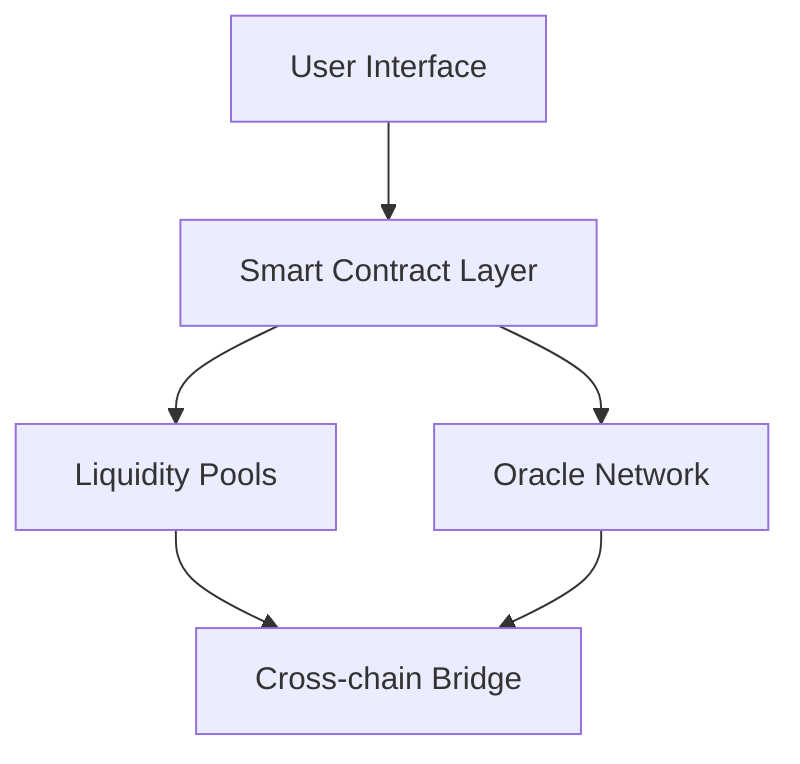

---
# Welcome to MetaFinance Protocol

:::
MetaFinance is currently in beta. While the protocol is audited, please use caution when interacting with smart contracts.
:::

## Quick Start

Get started with MetaFinance in minutes:

1. Install MetaMask or your preferred Web3 wallet
2. Connect to Ethereum Mainnet
3. Get some ETH for gas fees
4. Visit our dApp at app.metafinance.io

## Key Features

### Cross-chain Liquidity Pools 🌊

=== "Ethereum"
    - Native ETH staking
    - ERC-20 token pools
    - Gas optimization features

=== "Polygon"
    - MATIC rewards
    - Ultra-low fees
    - Bridge integration

=== "Arbitrum"
    - Layer 2 scalability
    - Lower transaction costs
    - Quick finality

### Smart Contract Integration

```solidity title="MetaFinance.sol"
pragma solidity ^0.8.0;

interface IMetaFinance {
    function deposit(uint256 amount) external;
    function withdraw(uint256 amount) external;
    function getRewards() external view returns (uint256);
}
```

### Advanced Features

#### Automated Market Making

Our proprietary AMM algorithm provides:

- Minimal price impact
- Reduced impermanent loss
- Dynamic fee adjustment

:::note
Fees are automatically adjusted based on market volatility and pool utilization.
:::

#### Yield Optimization

| Strategy | APY Range | Risk Level |
|----------|-----------|------------|
| Staking  | 5-10%     | Low        |
| Farming  | 10-20%    | Medium     |
| Lending  | 15-25%    | High       |

### Security Features

1. Multi-sig wallet requirements
2. Time-locks on critical functions
3. Emergency pause functionality
4. Real-time monitoring

:::warning
Always verify contract addresses and transaction details before signing.
:::

## Technical Architecture



## Performance Metrics

| Metric | Value | Change |
|--------|-------|--------|
| TVL    | $500M | +15%   |
| Daily Volume | $50M | +8% |
| Active Users | 50k | +25% |

### Risk Management

> "Security first" is our core principle. All smart contracts undergo rigorous testing and auditing.

:::danger
Never share your private keys or seed phrases with anyone, including MetaFinance team members.
:::

## Future Roadmap

### Q1 2025
- [ ] Layer 2 expansion
- [ ] Mobile app launch
- [x] Governance token
- [ ] DAO implementation

### Q2 2025
- [ ] Cross-chain messaging
- [ ] NFT integration
- [ ] Institutional features

## Contact & Support

Need help? Our community is here to support you:

- Discord: [discord.gg/metafinance](https://discord.gg/metafinance)
- Twitter: [@MetaFinance](https://twitter.com/metafinance)
- Email: support@metafinance.io

:::tip
Join our Discord for real-time support and community discussions!
:::